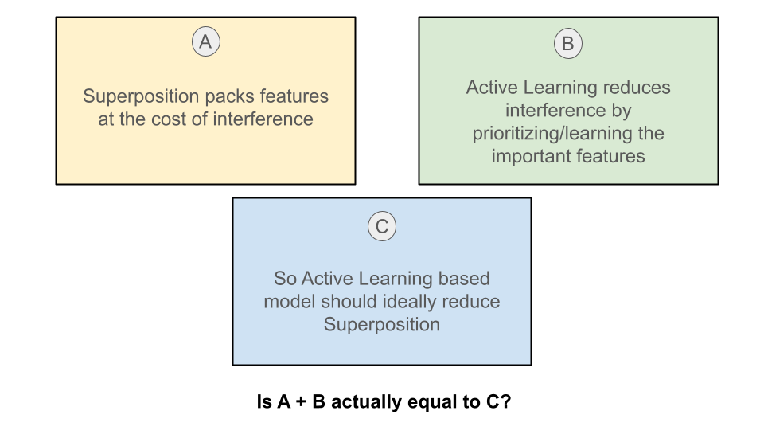

# STALL
# Superposition through Active Learning Lens

**'How can we control whether superposition and polysemanticity occur?’** was one of the open questions mentioned by the authors of ‘Toy Models of Superposition’ and this work was an attempt to do so with the help of Active Learning.

The hypothesis for this project was that by focusing on difficult samples through Active Learning, the model would reduce attention to redundant features, thereby decreasing the overall feature representation required and minimizing superposition. Uncertainty-based sampling, which prioritizes training on sample points where the model is least certain, was employed. It was assumed that these uncertain samples lie near decision boundaries or areas lacking sufficient training data, and learning from them would impact superposition in the feature space.

  

**Methodology**

**Datasets:**

- CIFAR-10: A dataset consisting of 60,000 32x32 color images in 10 classes, with 6,000 images per class.
- Tiny ImageNet: A dataset containing 200 classes, each with 500 training images, and 50 validation images, resized to 64x64.

**Model Architecture:**

A pre-trained ResNet-18 architecture was modified for CIFAR-10 and Tiny ImageNet by adjusting the final fully connected layer to output 10 and 200 classes, respectively.

**Evaluation Criteria:**

- t-SNE Visualizations: To observe feature clustering and separation.
- Cosine Similarity Histograms: To analyze the distribution of feature vector similarities.
- Silhouette Scores: To measure how well clusters are separated.
- Davies-Bouldin Index: To evaluate cluster compactness and separation.

**Results:**

The Active Learning model did not show significant improvement over the baseline model in terms of feature separation or accuracy.
Both models exhibited similar patterns in cosine similarity distributions, indicating that Active Learning did not effectively reduce superposition.
Analysis of t-SNE plots showed that feature clusters were not more distinct in the Active Learning model compared to the baseline.
Silhouette Scores and Davies-Bouldin Indexes further supported the observation that Active Learning did not significantly alter feature space organization or reduce superposition.

## Navigation

- [Notebooks](./Notebooks)

Contains Colab Notebooks for both datasets for getting Baseline as well as uncertainity based Active Learning Model training and results

- [Results](./Results)

Contains all the activation maximizations for both datasets for the Layer_4_1_conv2 and the results used in the paper

- [Paper](./Stall.pdf)

Contains the paper written on this project

